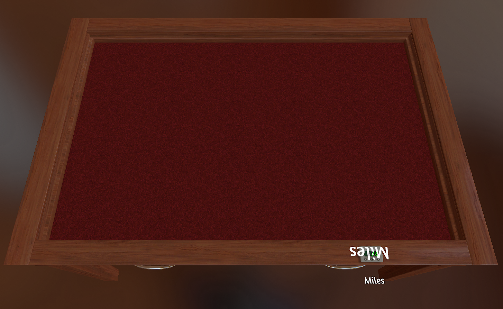

# Player HP Counters

Global script for **The Dungeon of Fellstone** (Tabletop Simulator).

Every player who takes a seat automatically gets a health counter on the table
rim, next to their nameplate. The counter is tinted to their seat colour and
labelled with their Steam name. Empty seats get no counter, and a counter is
removed when its player leaves.



---

## What it does

| Behaviour | Detail |
| --- | --- |
| Spawns on seat | A `Counter` object appears when a player picks a colour |
| Positioned by seat | Placed on the table rim closest to that player's nameplate |
| Colour-coded | Tinted with the seat colour via `Color.fromString()` |
| Named | Floating text label showing the player's Steam name |
| Starts at 20 HP | Configurable via `START_HP` |
| Cleans up | Counter is destroyed when the player leaves or changes seat |
| Survives save/load | Counter GUIDs are stored in `onSave` |
| Reset command | Right-click empty table space → **Reset all HP** |

Grey (spectator) and Black (Game Master) seats are excluded — neither has HP
under our rules.

---

## Installation

1. Open the mod in Tabletop Simulator as **host**.
2. `Modding` → `Scripting` (or press `\` for the console, then open the
   scripting editor).
3. Select the **Global** tab.
4. Paste in the contents of `Global.lua`, replacing whatever is there.
5. Click **Save & Play**.

Counters appear immediately for anyone already seated.

> Scripting only runs on the host's machine. If you hand the host role to
> someone else mid-session, the script keeps running, but that person now owns
> it — make sure whoever hosts has the current version saved.

---

## Configuration

All tunable values are at the top of the file:

```lua
local START_HP   = 20    -- Starting health for every player
local RIM_INSET  = 1.5   -- How far in from the table's outer edge to sit
local HOVER      = 0.4   -- Height above the rim
local MIN_GAP    = 2.5   -- Minimum spacing between two counters
local LABEL_SIZE = 180   -- Font size of the name label
```

### `RIM_INSET` is the one you'll actually adjust

The table rim is only a couple of units wide, so the default may leave the
counter half-hanging over the play area or half-buried in the outer lip. Change
it in steps of `0.5` and hit Save & Play to see the result.

### `SUPPORTED_COLORS`

The list of seats that get a counter. Trim it to the colours your group
actually uses — fewer seats means fewer chances of two counters landing on top
of each other.

### `ROUND_TABLES`

Round-rimmed tables need a different placement calculation from rectangular
ones. The script picks automatically based on `Tables.getTable()`.

**Custom tables are the exception.** Both the round and the rectangular custom
table report the same name, `Table_Custom`, so the script can't tell them
apart. If your team uses a custom *round* table, add this line:

```lua
Table_Custom = true,
```

---

## How placement works

The player's nameplate on the table rim and their hand zone share the same
anchor, so the hand zone is a reliable proxy for "where the name is".

1. `Player[color].getHandTransform()` gives the seat position.
2. Take the unit vector from the table centre out towards that seat.
3. Find where that ray leaves the table's bounds — a circle test for round
   tables, a box test for rectangular ones.
4. Pull back inward by `RIM_INSET` and lift by `HOVER`.
5. If the resulting spot is within `MIN_GAP` of an existing counter, slide
   along the rim tangent until it clears.

The label is a **zero-size button** (`width = 0, height = 0`), which renders as
plain text with no background and can't be clicked. That's why it needs a
`click_function` pointing at the empty `noop()` — the object errors on load
without one.

---

## Troubleshooting

**Label text is upside down or invisible**
Flip `rotation` in `attachLabel` between `{0, 0, 0}` and `{0, 180, 0}`. The
counter model's orientation and the button's default facing don't always agree.

**Label text is enormous or microscopic**
`font_size` scales with the object. If you've changed the counter's `scale`,
adjust `LABEL_SIZE` by the same factor.

**Counter is off the edge of the table**
Increase `RIM_INSET`. On a custom round table, check the `ROUND_TABLES` note
above — a round table treated as rectangular puts counters off the edge at the
diagonals.

**Two counters overlapping**
Increase `MIN_GAP`. The nudge routine gives up after 8 attempts, so with many
adjacent seats on a small table it may run out of room.

**Duplicate counters after loading a save**
Shouldn't happen — GUIDs are persisted and checked. If it does, the stored GUID
went stale in a way `getCounter()` didn't catch. Delete the extras by hand and
re-save; the state rebuilds cleanly.

**Nothing spawns at all**
Check that the host hasn't disabled colour changing
(`Options` → `Permissions` → `Change Color`). Without it, players stay Grey and
`p.seated` is never true.

---

## Known limitations

- **Rim placement spreads HP around the table.** Nobody can scan everyone's
  health at a glance, which matters in a dungeon crawl where players coordinate
  on who's about to go down. Worth playtesting against a single central HP row
  before committing.
- **Hexagon and octagon tables** are treated as circles. Close enough at normal
  inset values, slightly off at the corners.
- **The nudge routine slides one direction only** and gives up after 8 tries.
  Fine for 4–6 seats; not a real packing solution.
- **Counters are locked** (`setLock(true)`), so players change HP through the
  counter's own +/− controls, not by dragging.

---

## API reference

Relevant docs at <https://api.tabletopsimulator.com/>:

- `onPlayerChangeColor` — fires on seat pick, seat change, and disconnect
- `Player.getHandTransform()` — seat position and rotation
- `Tables.getTableObject()` / `Tables.getTable()` — table geometry and name
- `Counter` behavior — `setValue`, `getValue`, `increment`, `decrement`
- `Color.fromString()` — seat colour name to RGB